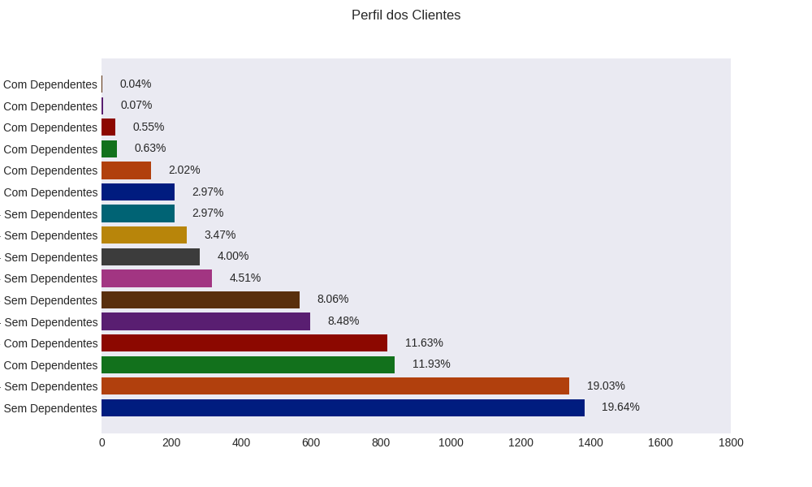
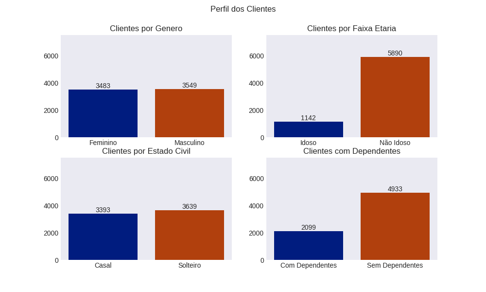
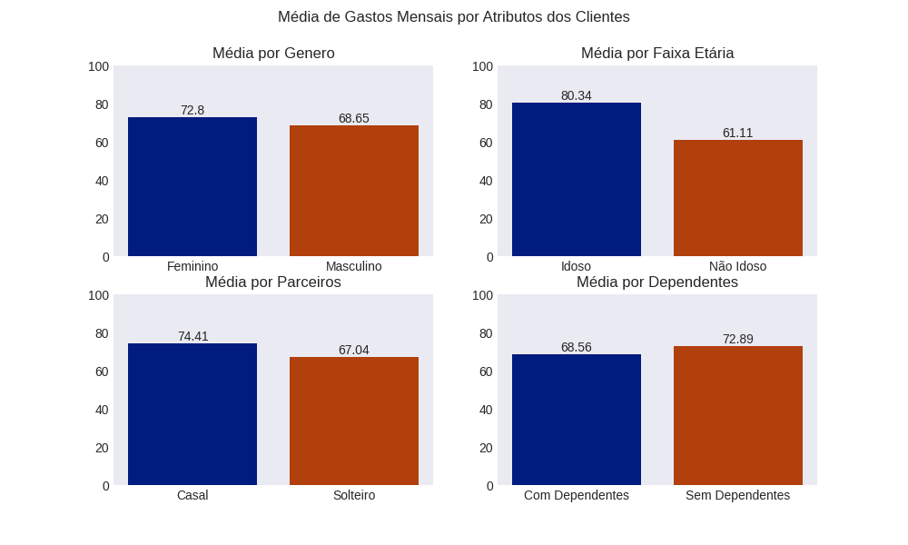
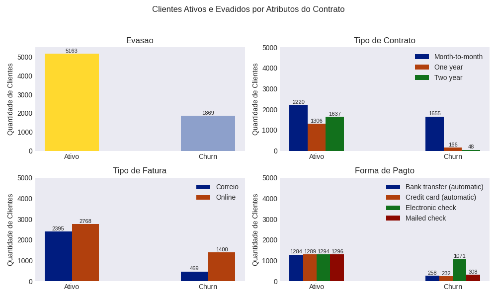
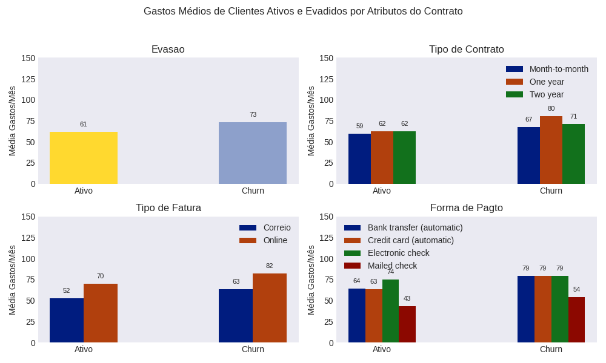
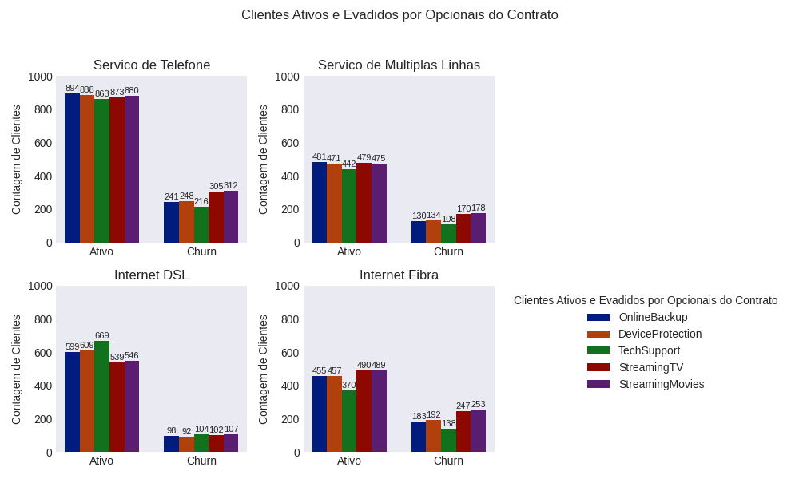
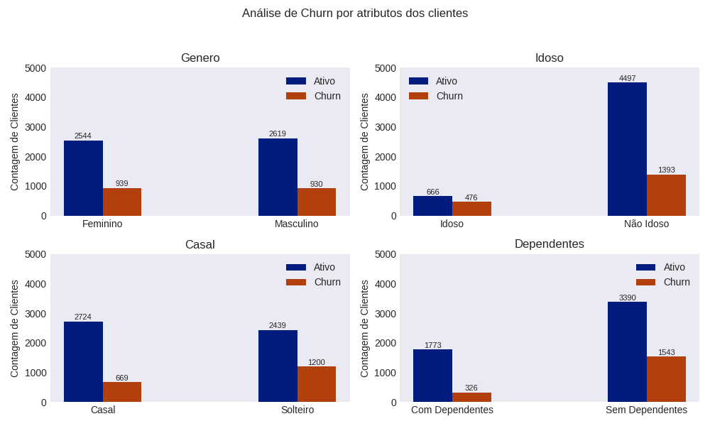
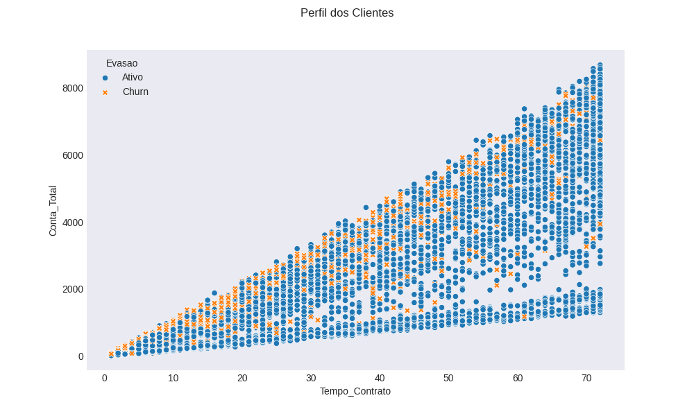
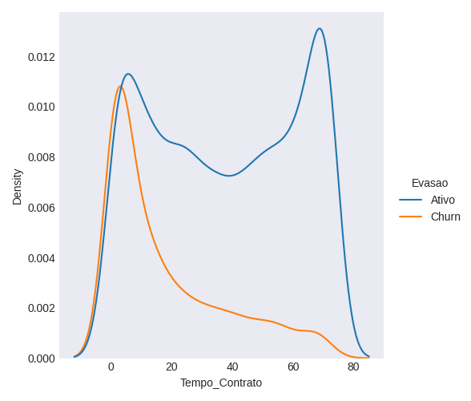
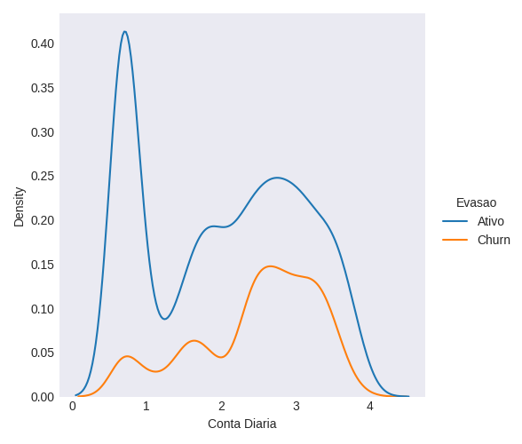

<h1> Exercícios: ONE Data Science Análise de Evasão de Clientes (Churn) - Telecom X </h1>

  
  
  
  
  
  
  

<h2>Resumo do projeto</h2>

# Análise de Evasão de Clientes (Churn) - Telecom X

## Introdução

Este projeto tem como objetivo analisar o fenômeno de evasão de clientes (Churn) na empresa Telecom X. O alto índice de cancelamentos representa um desafio significativo para a empresa, impactando diretamente a receita e o crescimento. Através da coleta, tratamento e análise exploratória dos dados, buscamos identificar os principais fatores que levam os clientes a cancelar seus serviços, fornecendo insights valiosos para a equipe de Data Science desenvolver modelos preditivos e estratégias de retenção eficazes.

## Detalhes do Projeto e Tecnologias Utilizadas

Este projeto seguiu a **Arquitetura Medalhão** para garantir a organização e a qualidade dos dados durante o processo de ETL (Extração, Transformação e Carga). A arquitetura é dividida em três camadas:

- **Camada Bronze:** Armazena os dados brutos, conforme recebidos da fonte.
- **Camada Prata:** Os dados são limpos, transformados e enriquecidos nesta camada.
- **Camada Ouro:** Os dados são refinados e otimizados para análise e tomada de decisões, estruturados em um esquema estrela.

As principais tecnologias e bibliotecas utilizadas neste projeto incluem:

- **Python:** Linguagem de programação principal.
- **Pandas:** Para manipulação e análise de dados.
- **NumPy:** Para operações numéricas.
- **Matplotlib e Seaborn:** Para visualização de dados.
- **Requests e JSON:** Para extração de dados da API.
- **OS:** Para manipulação de arquivos e diretórios.
- **DuckDB:** Utilizado como banco de dados analítico na camada Ouro para o esquema estrela.

## Limpeza e Tratamento de Dados

Os dados foram extraídos de uma fonte JSON e processados utilizando a arquitetura Medalhão, dividindo o trabalho em três camadas:

- **Camada Bronze:** Os dados brutos foram carregados diretamente do arquivo JSON.
- **Camada Prata:** Nesta camada, os dados foram limpos e transformados. As colunas com informações aninhadas em formato JSON foram normalizadas. Valores inconsistentes na coluna `Charges.Total` foram tratados, e a coluna foi convertida para o tipo numérico correto. Clientes com `tenure` igual a zero foram removidos, pois não forneciam informações relevantes para a análise de churn. Colunas binárias ('Yes'/'No' ou similares) foram convertidas para 1 e 0 para facilitar a análise numérica. Colunas categóricas como 'gender', 'Contract', 'PaymentMethod', e 'InternetService' foram convertidas para o tipo 'category' do pandas. Uma nova coluna `Contas_Diarias` foi criada calculando o gasto diário. As colunas foram traduzidas para o português e renomeadas para melhor compreensão.
- **Camada Ouro:** Os dados limpos e transformados da camada Prata foram carregados e estruturados em um esquema estrela utilizando DuckDB para facilitar a análise e consulta. Foram criadas as tabelas dim_clientes, dim_tipos_servicos, fato_servicos_clientes, dim_contratos e fato_gastos.

## Análise Exploratória de Dados (EDA)

Nesta seção, foram realizadas diversas análises para identificar padrões e tendências nos dados:

### Análise Descritiva

Foram apresentadas estatísticas descritivas gerais sobre o volume de clientes, taxa de churn, tempo de contrato e valores de contas mensais e totais.

Clientes                  : 7032
   -           Cancelados : 1869
   -       Não Cancelados : 5163
   -   Média cancelamento : 26.58%

Tempo de Contrato:
   -               Máximo : 72 meses
   -               Mínimo : 1 meses
   -                Médio : 32.42 meses
   -        Desvio padrão : 24.55 meses
   -              Mediana : 29.00 meses

Conta Mensal:
   -               Máximo : R$118.75
   -               Mínimo : R$18.25
   -                Médio : R$64.80
   -        Desvio padrão : R$30.09
   -              Mediana : R$70.35

Conta Total:
   -               Máximo : R$8684.80
   -               Mínimo : R$18.80
   -                Médio : R$2283.30
   -        Desvio padrão : R$2266.77
   -              Mediana : R$1397.47

### Análise de Perfil dos Clientes

Foram analisados os perfis dos clientes em relação a gênero, faixa etária (idoso/não idoso), estado civil (casal/solteiro) e dependentes.

### Análise de Gastos por Atributos dos Clientes

A análise dos gastos médios por diferentes atributos dos clientes revelou insights sobre o comportamento de consumo.

### Análise de Churn e Gastos por Atributos dos Contratos

A análise do churn e dos gastos em relação aos atributos dos contratos, como tipo de contrato, fatura online e forma de pagamento, 
forneceu informações sobre quais características contratuais estão mais associadas à evasão e aos gastos dos clientes.

### Análise de Churn por Atributos dos Serviços

A análise do churn em relação aos serviços contratados e opcionais ajudou a identificar quais serviços podem estar mais relacionados à evasão.

### Análise de Churn por Atributos dos Clientes

A análise do churn em relação aos atributos de perfil dos clientes (gênero, idade, estado civil, dependentes) ajudou a entender se certos grupos 
demográficos apresentam maior tendência a cancelar.

### Contagem de Evasão por Variáveis Numéricas

A análise da distribuição de variáveis numéricas, como tempo de contrato e gastos, entre clientes evadidos e ativos, ajudou a identificar 
possíveis limiares ou padrões associados ao churn.

## Conclusões e Insights

Com base na análise exploratória, podemos destacar os seguintes insights:

- Clientes com contratos de menor duração (mês a mês) apresentam uma taxa de churn significativamente maior.
- Clientes que utilizam a forma de pagamento "Electronic check" têm uma maior proporção de churn.
- Clientes com Internet Fibra Óptica parecem ter uma taxa de churn maior em comparação com outros tipos de serviço de internet.
- A ausência de serviços opcionais como Online Security, Online Backup, Device Protection e Tech Support parece estar associada a uma
- maior probabilidade de churn.
- Clientes com maior tempo de contrato e maiores gastos totais tendem a apresentar menor taxa de churn.

## Recomendações

Com base nos insights obtidos, sugerimos as seguintes recomendações para a Telecom X:

- Desenvolver programas de fidelidade e incentivos para clientes com contratos de menor duração, visando a renovação para contratos mais longos.
- Investigar possíveis problemas ou insatisfações associadas à forma de pagamento "Electronic check" e oferecer alternativas ou melhorias no processo.
- Avaliar a qualidade do serviço de Internet Fibra Óptica e a satisfação dos clientes, buscando identificar e solucionar possíveis problemas que possam estar levando ao churn.
- Promover os serviços opcionais de segurança e suporte técnico para os clientes, destacando os benefícios e o valor agregado para reduzir a probabilidade de churn.
- Implementar estratégias de retenção direcionadas a clientes com menor tempo de contrato, oferecendo suporte proativo e benefícios exclusivos.

Essas recomendações podem servir como ponto de partida para a equipe de Data Science desenvolver modelos preditivos mais precisos e implementar estratégias de retenção mais eficazes.

<h2> Autor </h2>

[  Mauricio Andre de Almeida](https://github.com/mauricioaalmeida) 
